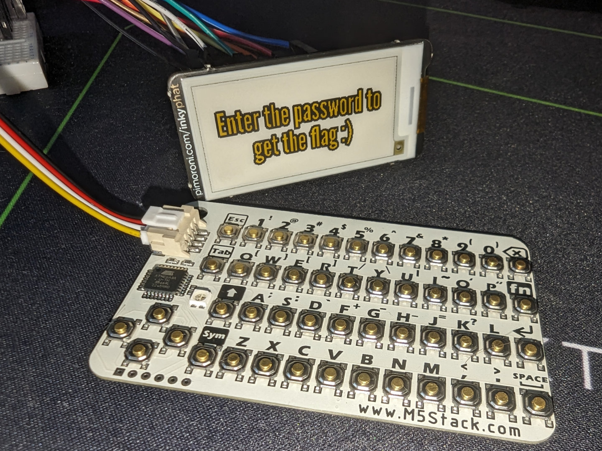
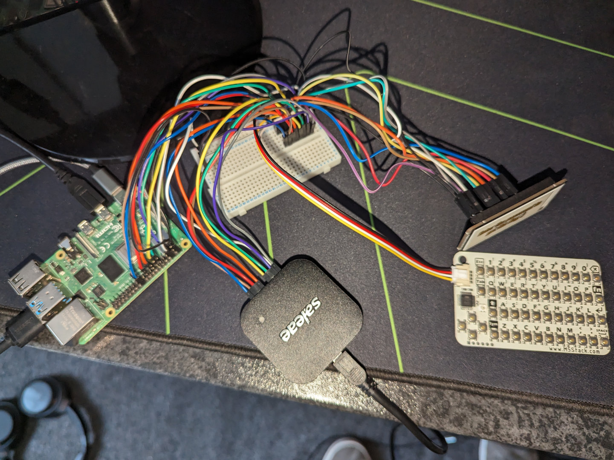
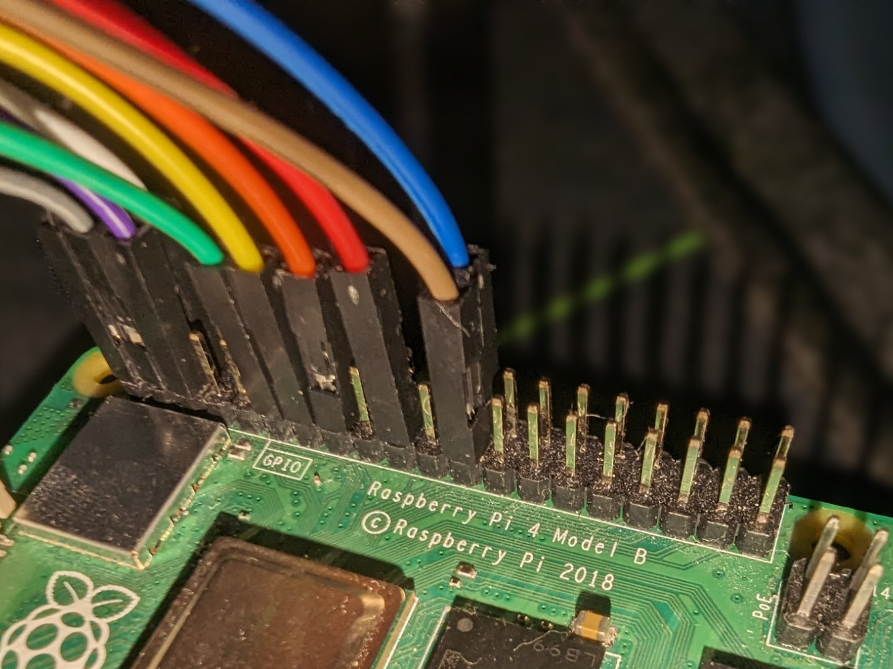
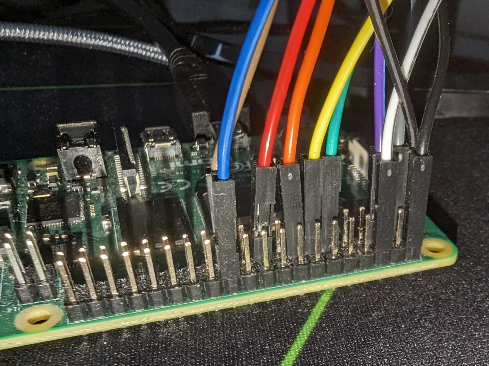
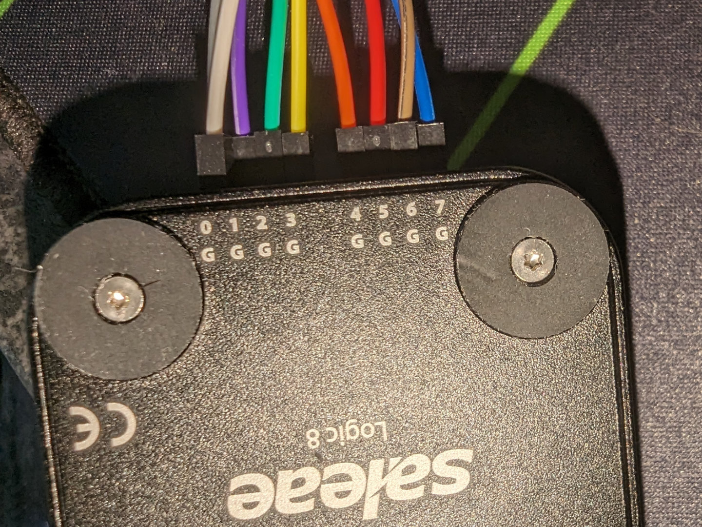
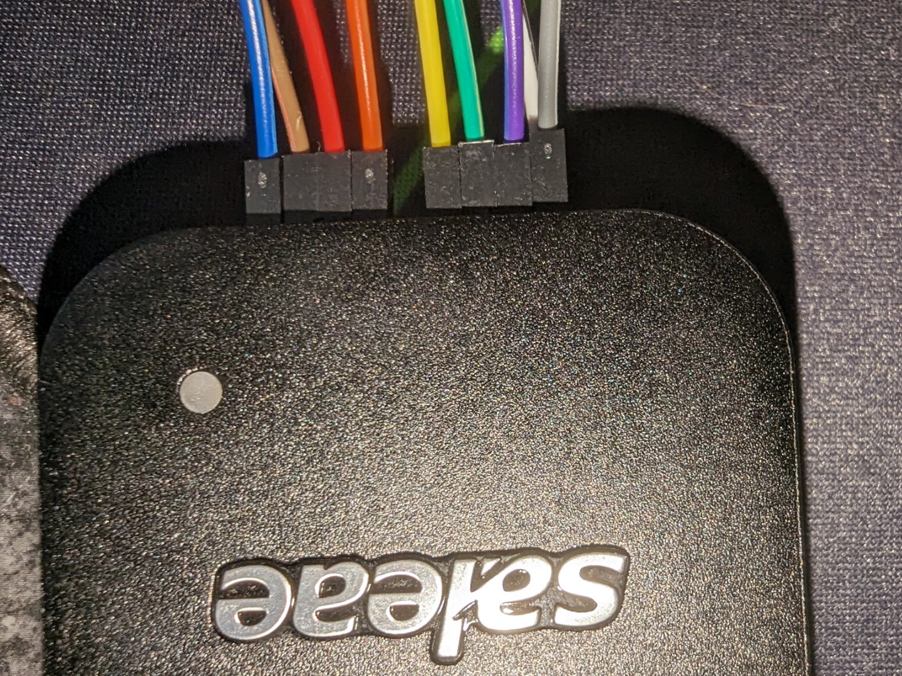
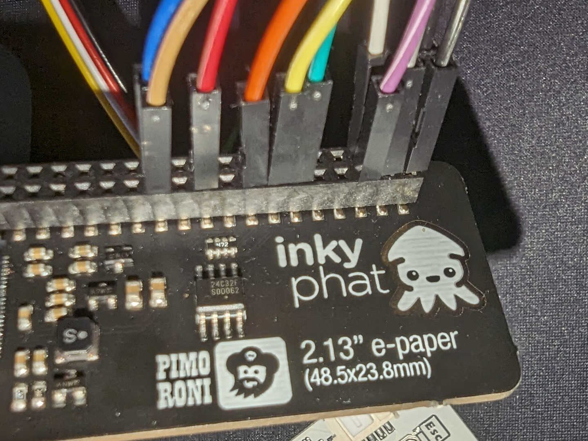
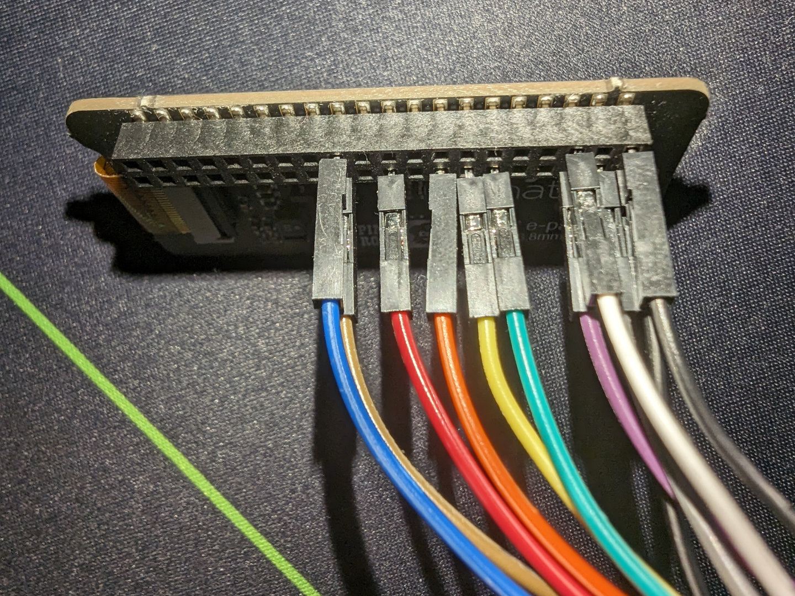

# Description

I came across this [mysterious device](#device). So I [hooked up my logic analyser](#everything) and recorded somebody using it (`capture.sol`).

This challenge has two flags in the `flag{}` format:

- The first (easier) is the password that was typed on the keyboard.
- The second (significantly harder) is what was displayed to the screen after the password was entered.

[Close up images of the setup](#images) have been provided.

Where possible, wire colours have been consistent (i.e. black will always be 3.3v or 5v power , white will always be ground and the others are for you to work out). The only exception is the cable plugged into the keyboard:

| Keyboard Cable | Everywhere Else |
| -------------- | --------------- |
| Black          | White           |
| Red            | Black           |
| White          | Grey            |
| Yellow         | Purple          |

Good luck :)

# Images

## Device

## Everything

## Raspberry Pi

## Logic Analyser

## Display

