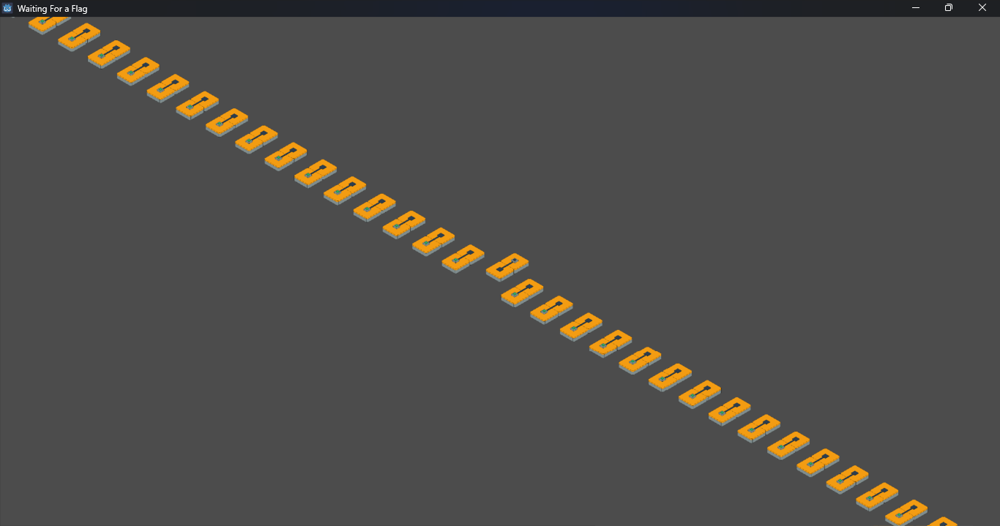
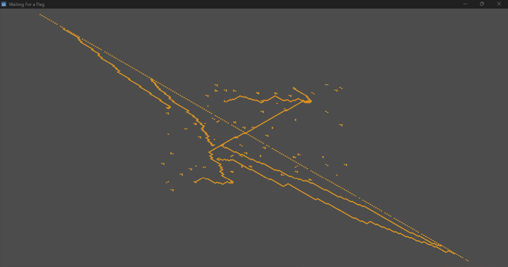

# Objective

After playing through the first few levels, we come to this:



Many switches with a single light.

Below are tens of levels, all with jumbles of wires and logic gates:



It seems likely that finding the correct combination of switches will get us the flag, but doing this through normally interacting with the game does not seem possible.

# Extracting

It clear from the game's icon and loading screen that it was developed using the Godot game engine. This means we can try and use [Godot RE Tools](https://github.com/bruvzg/gdsdecomp) to extract the game files. Doing so however reveals that the game is encrypted and we need to set the key:

```
Set correct encryption key and try again.
```

Finding the encryption key is not too difficult. It is referenced [here](https://github.com/godotengine/godot/blob/c73ac74c4a44ccfed158b3603f809a24590bac0a/core/io/file_access_pack.cpp#L401) in the Godot source code, so we can load the project binary into Ghidra (analysis takes some time) and search for the string `Can't open encrypted pack-referenced file`. Doing so reveals two references, both in the same function. From there we can locate this code:

```c
        do {
          uVar15 = (uint)((ulonglong)in_stack_ffffffffffffff78 >> 0x20);
          if (*(int *)(local_40 + -4) <= (int)lVar11) break;
          uVar2 = (&DAT_1435991c0)[lVar11];
          if (1 < *(uint *)(local_40 + -8)) {
            FUN_141de2e70(&local_40);
          }
          uVar15 = (uint)((ulonglong)in_stack_ffffffffffffff78 >> 0x20);
          *(undefined *)(local_40 + lVar11) = uVar2;
          lVar11 = lVar11 + 1;
        } while (local_40 != 0);
```

Which corresponds to the for loop in the source code. Going to `DAT_1435991c0` reveals the 32 byte key: `420dcf9bbd5d122eb97414eaea19788798d5004c3c3f5af8a915e75fda9130fb`. After putting the key into Godot RE Tools we can successfully extract the game project and open it in the Godot editor.

# Analysing

The game has two scripts:

- `camera.gd` - Small and only handles camera movement.
- `main.gd` - Large and handles the rest of the game logic.

Both scripts seem to be somewhat obfuscated, with most variables named `beckett` followed by a number.

For brevity I will not include the process of obfuscating the scripts here. The deobfuscated versions can be found in `source/waiting_for_a_flag`. The key takeaways are:

- Levels are stored in the `levels` folder as binary files with the repeated format:
  - X coordinate (4 bytes).
  - Y coordinate (4 bytes).
  - Z coordinate (4 bytes).
  - Tile (1 byte).
- The level we are interested in is number `3`.
- After the light is lit, the buttons are interpreted as binary (from negative to positive X). The ASCII representation of this is the flag.
- The tiles are (starting at 0):
  - `WIRE_NS_OFF`
    - `WIRE_EW_OFF`
    - `WIRE_NS_ON`
    - `WIRE_EW_ON`
    - `CORNER_NE_OFF`
    - `CORNER_ES_OFF`
    - `CORNER_SW_OFF`
    - `CORNER_WN_OFF`
    - `CORNER_NE_ON`
    - `CORNER_ES_ON`
    - `CORNER_SW_ON`
    - `CORNER_WN_ON`
    - `FORK_NES_OFF`
    - `FORK_ESW_OFF`
    - `FORK_SWN_OFF`
    - `FORK_WNE_OFF`
    - `FORK_NES_ON`
    - `FORK_ESW_ON`
    - `FORK_SWN_ON`
    - `FORK_WNE_ON`
    - `ALL_OFF`
    - `ALL_ON`
    - `VIA_N_OFF`
    - `VIA_E_OFF`
    - `VIA_S_OFF`
    - `VIA_W_OFF`
    - `VIA_N_ON`
    - `VIA_E_ON`
    - `VIA_S_ON`
    - `VIA_W_ON`
    - `AND_E_OFF_W_OFF`
    - `AND_E_ON_W_OFF`
    - `AND_E_OFF_W_ON`
    - `AND_E_ON_W_ON`
    - `OR_E_OFF_W_OFF`
    - `OR_E_ON_W_OFF`
    - `OR_E_OFF_W_ON`
    - `OR_E_ON_W_ON`
    - `XOR_E_OFF_W_OFF`
    - `XOR_E_ON_W_OFF`
    - `XOR_E_OFF_W_ON`
    - `XOR_E_ON_W_ON`
    - `NOT_S_OFF`
    - `NOT_S_ON`
    - `SWITCH_N_OFF`
    - `SWITCH_N_ON`
    - `LIGHT_S_OFF`
    - `LIGHT_S_ON`
    - `VIA_NONE_OFF`
    - `VIA_NONE_ON`

# Solving

To solve the circuit, we will implement it in Python using Z3 (see `solve.py`).

After running the script and interpreting the output as ASCII, we get the flag:

```
crew{h3_n3v3r_4rr1v3d_9c6ddf}
```

